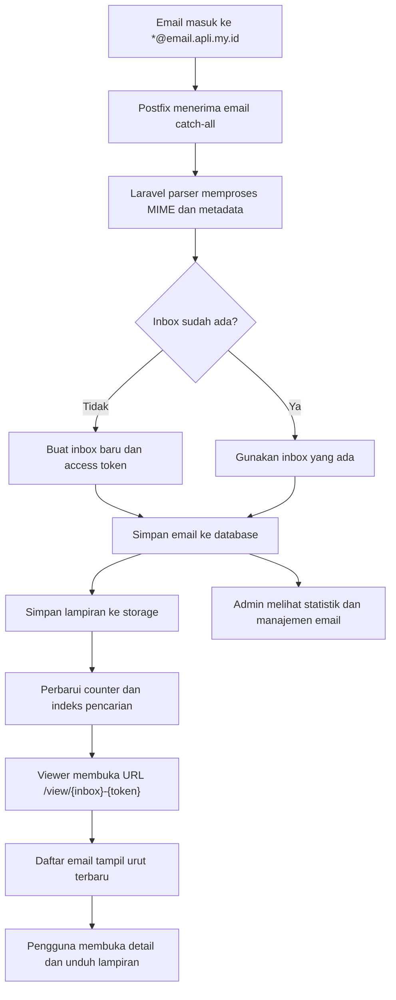

## 1. Gambaran Produk
APLI Mail adalah aplikasi web catch-all email viewer untuk domain `email.apli.my.id` yang otomatis menerima semua email masuk, membuat inbox dinamis, dan menampilkan isi email melalui browser.
- Sistem menyelesaikan kebutuhan monitoring email wildcard tanpa pembuatan akun manual, cocok untuk operasional, QA, marketing, dan kebutuhan sementara per alamat email.
- Nilai utama produk adalah provisioning inbox otomatis, akses berbasis token, antarmuka modern, dan kesiapan deployment pada VPS Ubuntu 24.04.

## 2. Fitur Inti

### 2.1 Peran Pengguna
| Peran | Metode Akses | Hak Akses Inti |
|------|--------------|----------------|
| Pengunjung Viewer | URL inbox bertoken | Melihat daftar email, membuka detail email, mengunduh lampiran |
| Admin | Laravel Authentication | Melihat dashboard, statistik, pencarian inbox/email, menghapus inbox/email, memantau storage |

### 2.2 Modul Fitur
1. **Halaman Inbox Viewer**: daftar email terbaru, pencarian email, indikator lampiran, pagination, penghitung email.
2. **Halaman Detail Email**: metadata email, render HTML tersanitasi, tampilan teks mentah, daftar lampiran untuk diunduh.
3. **Dashboard Admin**: metrik total inbox/email/lampiran, grafik email per hari, pencarian, penghapusan inbox dan email.
4. **Sistem Ingestion Email**: penerimaan email catch-all via Postfix, parsing MIME, penyimpanan database, pembuatan inbox otomatis.
5. **API Internal dan Publik**: endpoint daftar inbox/email, detail data, dan penghapusan email untuk integrasi operasional.

### 2.3 Detail Halaman
| Nama Halaman | Modul | Deskripsi Fitur |
|--------------|-------|-----------------|
| Inbox Viewer | Header inbox | Menampilkan nama inbox, alamat email target, jumlah email, tombol salin alamat dan toggle dark mode |
| Inbox Viewer | Toolbar pencarian | Pencarian berdasarkan subject, sender, dan isi ringkas email |
| Inbox Viewer | Daftar email | Menampilkan subject, sender, tanggal, preview isi, indikator lampiran, status email terbaru |
| Inbox Viewer | Pagination | Navigasi halaman email yang tetap ringan untuk inbox besar |
| Detail Email | Metadata panel | Menampilkan From, To, Subject, Received Time, jumlah lampiran |
| Detail Email | Tampilan HTML | Render `body_html` yang telah disanitasi untuk mencegah XSS |
| Detail Email | Tampilan teks | Menampilkan `body_text` sebagai fallback yang mudah dibaca |
| Detail Email | Lampiran | Daftar file dengan ukuran, MIME type, dan tombol unduh |
| Dashboard Admin | Summary cards | Total inbox, total email, total lampiran, email hari ini |
| Dashboard Admin | Statistik | Grafik jumlah email per hari dan ringkasan tren |
| Dashboard Admin | Manajemen inbox | Tabel inbox, pencarian cepat, lihat jumlah email, hapus inbox |
| Dashboard Admin | Manajemen email | Tabel email global, filter sender/subject, hapus email |
| Halaman Login Admin | Form login | Login aman menggunakan autentikasi Laravel dan proteksi rate limit |

## 3. Proses Inti
Alur utama sistem dimulai ketika Postfix menerima email ke alamat wildcard `*@email.apli.my.id`. Laravel mail ingestion pipeline mengekstrak local part sebagai nama inbox. Jika inbox belum ada, sistem membuat record inbox baru, slug, dan `access_token`. Selanjutnya email disimpan ke tabel `emails`, lampiran disimpan ke storage lokal atau S3-compatible, lalu viewer inbox dapat langsung diakses melalui URL tokenized.

Admin masuk melalui halaman autentikasi Laravel untuk melihat statistik, mencari inbox, memeriksa email global, dan melakukan penghapusan data bila diperlukan.

## 4. Desain Antarmuka
### 4.1 Gaya Desain
- Warna utama: putih dingin, abu-abu muda, biru sebagai aksen, dengan dark mode bernuansa slate gelap.
- Gaya tombol: rounded medium, border halus, hover lembut, fokus jelas.
- Tipografi: judul tegas modern, body font bersih dan mudah dibaca untuk daftar email padat.
- Tata letak: desktop-first dengan sidebar ringan dan panel konten ala Gmail.
- Ikon: garis tipis modern untuk inbox, attachment, search, delete, moon/sun, mail.

### 4.2 Ringkasan Desain Halaman
| Nama Halaman | Modul | Elemen UI |
|--------------|-------|-----------|
| Inbox Viewer | Shell layout | Top bar lengket, breadcrumb ringan, kartu ringkasan inbox, background netral |
| Inbox Viewer | Daftar email | Baris email padat namun readable, highlight hover, badge lampiran, preview teks |
| Detail Email | Panel konten | Split layout metadata + isi email, card putih, border tipis, scroll area nyaman |
| Dashboard Admin | Statistik | Kartu metrik, grafik area/bars, tabel administratif, filter sticky |
| Halaman Login Admin | Form | Card terpusat, visual minimal premium, validasi jelas |

### 4.3 Responsivitas
- Desktop-first untuk pengalaman operasional utama.
- Tablet menyesuaikan menjadi dua kolom fleksibel dengan panel yang dapat menumpuk.
- Mobile menampilkan list-email dan detail secara bertahap, toolbar dipadatkan, dan tombol penting tetap mudah dijangkau.

## 5. Kebutuhan Fungsional
- Sistem menerima semua email ke `*@email.apli.my.id` tanpa pembuatan akun manual.
- Sistem otomatis membuat inbox saat email pertama diterima.
- Sistem membuat `access_token` acak dan stabil untuk inbox baru.
- URL viewer menggunakan format `/view/{inbox_name}-{token}`.
- Daftar email diurutkan berdasarkan email terbaru.
- Viewer menampilkan jumlah email, pencarian, pagination, dan indikator lampiran.
- Detail email menampilkan HTML tersanitasi dan teks mentah.
- Lampiran dapat diunduh jika masih tersedia di storage.
- Admin dapat login, melihat statistik, mencari inbox, dan menghapus inbox/email.
- API menyediakan daftar dan detail inbox/email, serta penghapusan email.

## 6. Kebutuhan Non-Fungsional
- Keamanan: sanitasi HTML, proteksi XSS, SQL injection protection melalui ORM/query builder, CSRF protection, rate limiting.
- Batas lampiran: maksimal 25 MB per file.
- Kinerja: daftar email dipaginasi dan kueri diindeks untuk inbox besar.
- Reliabilitas: ingestion email diproses melalui queue Redis untuk parsing dan penyimpanan lampiran yang berat.
- Deployability: berjalan dalam Docker Compose dengan layanan Laravel App, PostgreSQL, Redis, dan Nginx.
- Operasional: mendukung storage lokal secara default dan S3-compatible sebagai opsi produksi.

## 7. Data dan Pencarian
- `inboxes`: identitas inbox dinamis, slug, dan token akses.
- `emails`: metadata email, subject, pengirim, penerima, isi HTML/teks, waktu terima.
- `attachments`: relasi ke email, path file, ukuran, dan MIME type.
- Pencarian minimal mencakup inbox name, subject, sender email, dan sender name.

## 8. Asumsi Produk
- Domain `email.apli.my.id` dan MX record sudah diarahkan ke server Postfix.
- Admin menggunakan autentikasi Laravel standar dengan satu atau beberapa akun internal.
- Viewer inbox bersifat semi-private melalui URL bertoken, bukan autentikasi penuh per pengguna.
- Penghapusan inbox juga menghapus email dan lampiran terkait secara aman.
