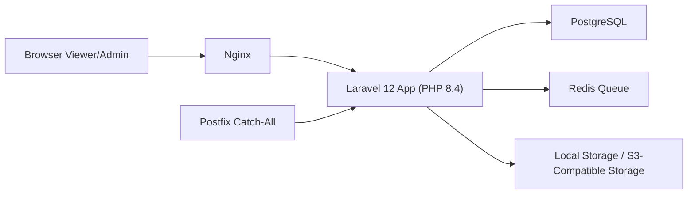
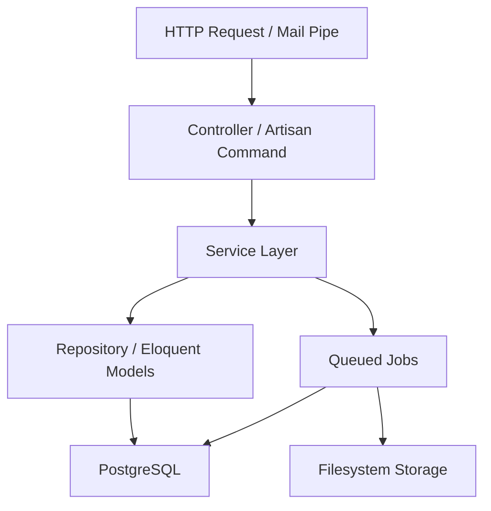
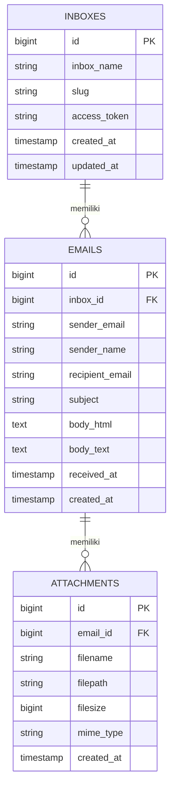

## 1. Desain Arsitektur


## 2. Deskripsi Teknologi
- Frontend: Laravel Blade + Tailwind CSS + Alpine.js ringan untuk interaksi mikro.
- Backend: Laravel 12 + PHP 8.4.
- Database: PostgreSQL 16.
- Queue dan cache: Redis 7.
- Mail server: Postfix catch-all dengan pipe ke command Laravel untuk ingestion email.
- Web server: Nginx sebagai reverse proxy ke PHP-FPM.
- Storage: local storage default, kompatibel dengan S3 via Laravel filesystem.
- Sanitasi HTML: library PHP sanitizer untuk whitelist tag aman sebelum render.
- Monitoring dasar: Laravel logs, queue worker logs, dan healthcheck container.

## 3. Definisi Rute
| Rute | Tujuan |
|------|--------|
| `/` | Redirect ke dashboard admin atau halaman informasi dasar |
| `/login` | Login admin |
| `/dashboard` | Dashboard admin dengan statistik dan pencarian |
| `/dashboard/inboxes` | Daftar inbox admin |
| `/dashboard/emails` | Daftar email admin |
| `/view/{inbox_name}-{token}` | Daftar email untuk inbox tertentu |
| `/view/{inbox_name}-{token}/emails/{email}` | Detail email inbox |
| `/attachments/{attachment}` | Unduh lampiran dengan validasi akses |

## 4. Definisi API
### 4.1 Endpoint
| Method | Endpoint | Tujuan |
|--------|----------|--------|
| GET | `/api/inboxes` | Daftar inbox dengan pagination dan pencarian |
| GET | `/api/inboxes/{id}` | Detail inbox dan ringkasan email |
| GET | `/api/emails` | Daftar email global dengan filter |
| GET | `/api/emails/{id}` | Detail email |
| DELETE | `/api/emails/{id}` | Hapus email dan lampiran terkait |

### 4.2 Skema Tipe Data
```php
<?php

/**
 * @property int $id
 * @property string $inbox_name
 * @property string $slug
 * @property string $access_token
 * @property string $viewer_key
 */
class InboxResource {}

/**
 * @property int $id
 * @property int $inbox_id
 * @property string $sender_email
 * @property ?string $sender_name
 * @property string $recipient_email
 * @property ?string $subject
 * @property ?string $body_html
 * @property ?string $body_text
 * @property string $received_at
 */
class EmailResource {}

/**
 * @property int $id
 * @property int $email_id
 * @property string $filename
 * @property string $filepath
 * @property int $filesize
 * @property string $mime_type
 */
class AttachmentResource {}
```

### 4.3 Contoh Respons
```json
{
  "data": {
    "id": 12,
    "inbox_name": "ahmad-alhijrah",
    "slug": "ahmad-alhijrah",
    "access_token": "f7k29a",
    "viewer_url": "/view/ahmad-alhijrah-f7k29a",
    "emails_count": 24
  }
}
```

## 5. Diagram Arsitektur Server


## 6. Model Data
### 6.1 Definisi Model Data


### 6.2 Data Definition Language
```sql
CREATE TABLE inboxes (
    id BIGSERIAL PRIMARY KEY,
    inbox_name VARCHAR(255) NOT NULL,
    slug VARCHAR(255) NOT NULL UNIQUE,
    access_token VARCHAR(64) NOT NULL UNIQUE,
    created_at TIMESTAMP NOT NULL DEFAULT CURRENT_TIMESTAMP,
    updated_at TIMESTAMP NOT NULL DEFAULT CURRENT_TIMESTAMP
);

CREATE INDEX idx_inboxes_inbox_name ON inboxes (inbox_name);

CREATE TABLE emails (
    id BIGSERIAL PRIMARY KEY,
    inbox_id BIGINT NOT NULL REFERENCES inboxes(id) ON DELETE CASCADE,
    sender_email VARCHAR(255) NOT NULL,
    sender_name VARCHAR(255) NULL,
    recipient_email VARCHAR(255) NOT NULL,
    subject VARCHAR(512) NULL,
    body_html TEXT NULL,
    body_text TEXT NULL,
    received_at TIMESTAMP NOT NULL,
    created_at TIMESTAMP NOT NULL DEFAULT CURRENT_TIMESTAMP
);

CREATE INDEX idx_emails_inbox_id_received_at ON emails (inbox_id, received_at DESC);
CREATE INDEX idx_emails_sender_email ON emails (sender_email);
CREATE INDEX idx_emails_subject ON emails (subject);

CREATE TABLE attachments (
    id BIGSERIAL PRIMARY KEY,
    email_id BIGINT NOT NULL REFERENCES emails(id) ON DELETE CASCADE,
    filename VARCHAR(512) NOT NULL,
    filepath VARCHAR(1024) NOT NULL,
    filesize BIGINT NOT NULL,
    mime_type VARCHAR(255) NOT NULL,
    created_at TIMESTAMP NOT NULL DEFAULT CURRENT_TIMESTAMP
);

CREATE INDEX idx_attachments_email_id ON attachments (email_id);
```

## 7. Desain Modul Backend
- `App\Models\Inbox`, `Email`, `Attachment`: model utama dan relasinya.
- `App\Services\MailIngestionService`: parsing email mentah, pembuatan inbox, sanitasi body, dan dispatch job lampiran.
- `App\Services\InboxViewerService`: validasi URL bertoken, query daftar email, penghitung email, filter pencarian.
- `App\Services\AdminMetricsService`: agregasi statistik dashboard dan data grafik harian.
- `App\Jobs\ProcessInboundEmailJob`: job queue untuk parsing email berat dan penyimpanan lampiran.
- `App\Console\Commands\IngestRawEmailCommand`: command yang menerima raw email dari pipe Postfix atau file stdin.

## 8. Strategi Catch-All Postfix
- Konfigurasi domain virtual `email.apli.my.id` pada Postfix.
- Semua alamat wildcard diarahkan ke satu transport/alias yang memanggil command ingestion Laravel.
- Raw MIME email diteruskan ke command, lalu Laravel menyimpan hasil parse.
- Sistem mengekstrak local part sebelum `@email.apli.my.id` sebagai `inbox_name`.
- Token inbox dibuat sekali saat inbox baru tercipta dan dipakai untuk membentuk viewer URL.

## 9. Strategi Keamanan
- Gunakan sanitizer whitelist untuk `body_html`, buang script, inline event handler, dan URL berbahaya.
- Validasi MIME type dan batas ukuran lampiran 25 MB per file.
- Gunakan route model binding aman, authorization untuk admin route, signed logic untuk akses lampiran viewer.
- Gunakan query builder/Eloquent untuk mencegah SQL injection.
- Aktifkan CSRF protection untuk semua aksi form.
- Terapkan rate limiting pada login, API publik, dan halaman viewer.
- Simpan file lampiran di path tersegmentasi agar tidak mudah ditebak.

## 10. Strategi Deployment Docker
- `app`: container PHP 8.4 FPM + ekstensi PostgreSQL, Redis, intl, zip, imagick opsional.
- `nginx`: melayani HTTP dan aset statis serta meneruskan request PHP ke `app`.
- `postgres`: database utama dengan volume persisten.
- `redis`: queue dan cache.
- Service tambahan non-compose operasional: Postfix host/server terpisah atau service VPS yang mengirimkan raw email ke container app.

## 11. Seeder dan Sample Data
- Seeder admin default untuk login awal.
- Seeder inbox contoh: `ahmad-alhijrah`, `visa-alhijrah`, `tiket-alhijrah`.
- Seeder email contoh dengan kombinasi HTML, plain text, dan lampiran palsu untuk demonstrasi.

## 12. Keputusan Implementasi
- Viewer inbox bersifat tokenized URL, bukan login user mailbox penuh.
- Penghapusan inbox dilakukan cascade terhadap email dan lampiran.
- Storage default adalah local untuk kemudahan setup VPS, namun adapter S3 disiapkan lewat environment variable.
- Semua proses parsing email berat dijalankan asynchronous melalui Redis queue agar request ingestion tetap stabil.
